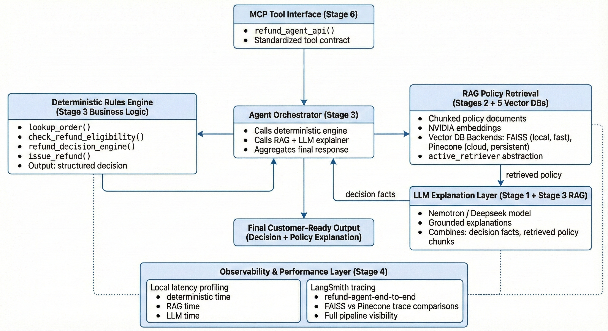

# CustomerServiceRefundAgent - A Full Stack Agentic Workflow
This project implements a production-style refund agent designed as an AI-assisted deep-dive to understand how real agents are built, debugged, evaluated, and deployed. End-to-end refund agent comprises of deterministic policy engine, RAG with FAISS + Pinecone, NVIDIA Nemotron LLM explanations, LangSmith tracing, eval harnesses, and MCP tool interface. Hands-on architecture exploration using AI-assisted development.

---

### Key Components

* **Deterministic Refund Decision Engine:** Policy-accurate and auditable logic for refund decisions.
* **RAG Pipeline:** Uses **FAISS + Pinecone** with **NVIDIA Embeddings** for robust context retrieval.
* **LLM Explanation Layer:** Powered by **NVIDIA Nemotron** for generating clear, natural-language explanations of the agent's decisions.
* **Observability:** Instrumented with **LangSmith** for tracing, latency monitoring, and evaluation.
* **Tooling:** **MCP tool interface** to expose the agent's capabilities to external LLMs or autonomous agents.

---

### Architecture Overview

The following diagram illustrates the flow of the agentic workflow:



---

### There are two ways you can run this project

#### A. Run the Entire Agent in Google Colab (Recommended)
This notebook was developed in **Google Colaboratory** for easy execution, experimentation, and debugging.

* **1. Open the Notebook:** The fastest way to get started is to click the **"Open in Colab"** badge below. This will open the notebook in a runnable, temporary environment.

    [](https://colab.research.google.com/github/<YOUR_GITHUB_USER>/<YOUR_REPO_NAME>/blob/main/refund_agent_notebook.ipynb)

    ***(Remember to replace the placeholders in the link above with your repository details!)***

* **2. Get Your Keys:** To run the entire workflow, you will need to acquire and configure your own API keys for the following services:
    * **Pinecone**
    * **NVIDIA API** (for Nemotron and Embeddings)
    * **LangSmith**
    * *Note: These should be stored in your **Colab Secrets** manager (the "key" icon in the left sidebar) to prevent them from being exposed in the notebook or saved to GitHub.*

* **3. Execution:** Once the notebook is open and your keys are configured, you can execute the cells sequentially to initialize the RAG pipeline, deploy the agent, and run traces.

#### B. Using MCP server through your agentic workflow
This project also includes an optional **Model Context Protocol (MCP) server** that exposes the refund agent as a standalone, interoperable tool. This allows any MCP-compatible client (e.g., ChatGPT, Claude, custom agents) to call the refund logic directly.

##### Why MCP?
MCP provides a standardized way for LLMs and agents to call external tools with below and turns the refund agent from a notebook-only workflow into a reusable microservice:
- deterministic inputs  
- structured JSON outputs  
- clean separation between tool logic and model reasoning  
- cross-model interoperability


##### 📁 Server File
* The server implementation lives in: refund_agent_mcp_server.py


##### ▶️ Running the MCP Server
* **1. Install the MCP Python package:**  
   ```bash
   pip install mcp
   
* **2. Start the server:**
python refund_agent_mcp_server.py

* **3. Add the following code to the ChatGPT client.json (or equivalent tool config)**
  
    {
      "tools": {
        "refund-agent": {
          "type": "python",
          "entrypoint": "refund_agent_mcp_server.py"
        }
      }
    }

* **4. Once configured, the agent becomes callable**
  
   tool(refund-agent).refund_agent_api(order_id="ORD-1001", claimed_defective=False)

##### What the MCP Tool Returns
The MCP tool responds with a structured JSON payload containing:
- deterministic policy decision
- refund eligibility details
- amount + status fields
- policy window calculations
- full LLM-generated explanation

This allows other agents or orchestration frameworks to integrate the refund workflow as a
building block.


